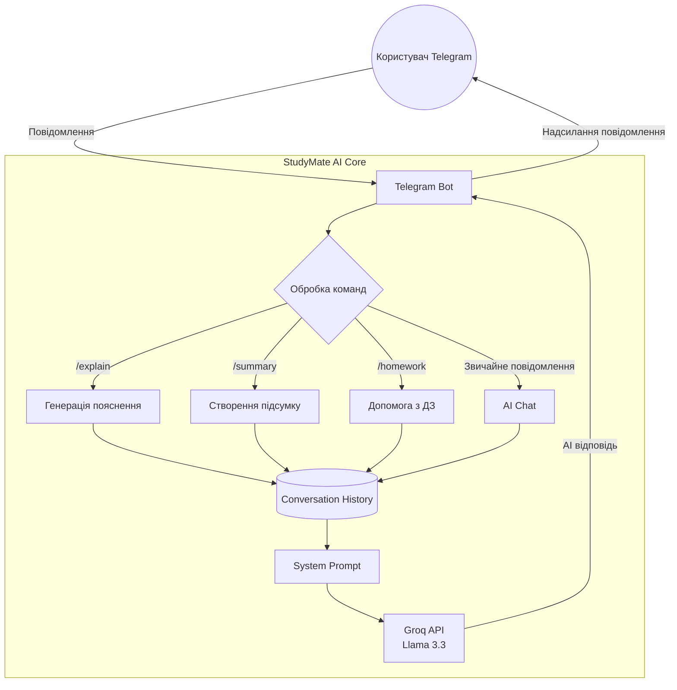

# 🎓 StudyMate AI — Telegram Bot (Node.js)

StudyMate AI — це навчальний Telegram-бот на базі **Node.js** + **Groq API** (`Llama 3.3`), який допомагає студентам та школярам пояснювати теми, розв’язувати домашні завдання, робити підсумки текстів і підтримувати контекст діалогу.

---

## ✨ Можливості

* 📖 **Пояснення тем простими словами**
* ✏️ **Допомога з домашніми завданнями**
* 📝 **Підсумок текстів та статей**
* 💬 **AI-чат із пам’яттю контексту**
* 🌍 **Підтримка різних мов**
* ⚡ **Швидкі відповіді через Groq API**
* 🧠 **Збереження історії діалогу**
* 📦 **Готовий запуск через Node.js**

---

## ⚙️ Технічна реалізація

Проєкт створений на **Node.js** з використанням:

* `node-telegram-bot-api` — Telegram Bot API
* `groq-sdk` — інтеграція з Groq AI
* `dotenv` — змінні середовища
* `Map()` — збереження історії користувачів у пам’яті

---

## 🔥 Основні особливості

### 1. AI-діалог через Groq API

Бот використовує модель `llama-3.3-70b-versatile` для генерації відповідей.
Усі повідомлення передаються разом із системним промптом та контекстом попередньої розмови.

---

### 2. Пам’ять діалогу (Conversation Memory)

Для кожного користувача створюється окрема історія повідомлень через `Map()`:

```js
const conversationHistory = new Map();
```

Бот:

* пам’ятає контекст діалогу;
* не “забуває” попередню тему;
* зберігає останні `MAX_HISTORY_LENGTH` пар повідомлень.

---

### 3. Система обмеження контексту

Щоб уникнути переповнення токенів:

* старі повідомлення автоматично видаляються;
* зберігається лише остання частина діалогу.

```js
const maxMessages = MAX_HISTORY_LENGTH * 2;
```

---

### 4. Обробка довгих повідомлень

Telegram має обмеження на довжину повідомлення (~4096 символів), тому бот автоматично розбиває довгі AI-відповіді на частини.

```js
text.match(/.{1,4000}/gs)
```

---

### 5. Командна система

Бот підтримує окремі AI-команди:

* `/explain`
* `/summary`
* `/homework`
* `/clear`

Кожна команда створює власний спеціалізований prompt для AI.

---

### 6. MarkdownV2 форматування

Використовується Telegram MarkdownV2:

* жирний текст;
* емодзі;
* структуровані відповіді;
* екранування спецсимволів.

---

## 🧠 Архітектура роботи бота



---

## 📁 Структура файлів

```bash
studymate_bot/
├── bot.js              # Основна логіка Telegram-бота
├── config.js           # Конфігурація та системний prompt
├── package.json        # Залежності Node.js
├── .env.example        # Приклад змінних середовища
└── .env                # API ключі (створюється вручну)
```

---

## 🚀 Встановлення та запуск

### 1. Встановлення залежностей

```bash
npm install
```

---

### 2. Створення `.env`

Скопіюй `.env.example` → `.env`

```env
TELEGRAM_BOT_TOKEN=токен_від_BotFather
GROQ_API_KEY=твій_groq_ключ
GROQ_MODEL=llama-3.3-70b-versatile
MAX_HISTORY_LENGTH=15
```

---

## 🔑 Де отримати ключі

* Telegram Bot Token → [BotFather](https://t.me/BotFather?utm_source=chatgpt.com)
* Groq API Key → [Groq Console](https://console.groq.com?utm_source=chatgpt.com)

---

## ▶️ Запуск бота

### Звичайний запуск

```bash
npm start
```

### Режим розробки

```bash
npm run dev
```

---

## 🤖 Команди бота

| Команда                | Опис                          |
| ---------------------- | ----------------------------- |
| `/start`               | Привітання та інструкція      |
| `/help`                | Список команд                 |
| `/clear`               | Очистити історію              |
| `/explain [тема]`      | Пояснення теми                |
| `/summary [текст]`     | Короткий підсумок             |
| `/homework [завдання]` | Допомога з домашнім завданням |

---

## 📌 Приклади використання

### Пояснення теми

```bash
/explain закон Ньютона
```

### Підсумок тексту

```bash
/summary [текст]
```

### Допомога з ДЗ

```bash
/homework знайди площу трикутника
```

---

## 🤖 Доступні моделі Groq

| Модель                    | Якість       | Швидкість   |
| ------------------------- | ------------ | ----------- |
| `llama-3.3-70b-versatile` | ⭐⭐⭐ Найкраща | Середня     |
| `llama-3.1-8b-instant`    | ⭐⭐ Добра     | Дуже швидка |
| `mixtral-8x7b-32768`      | ⭐⭐ Добра     | Швидка      |
| `gemma2-9b-it`            | ⭐⭐ Добра     | Швидка      |

---

## 📦 Залежності

```json
{
  "node-telegram-bot-api": "^0.66.0",
  "groq-sdk": "^0.5.0",
  "dotenv": "^16.0.0"
}
```

---

## 📌 Примітки

* Node.js **18+** обов’язковий
* Контекст зберігається лише під час роботи процесу
* `/clear` очищає історію конкретного користувача
* Бот підтримує багатомовність
* Максимальна довжина історії змінюється через `.env`

---

> 🎓 *StudyMate AI — твій персональний AI-помічник для навчання*
